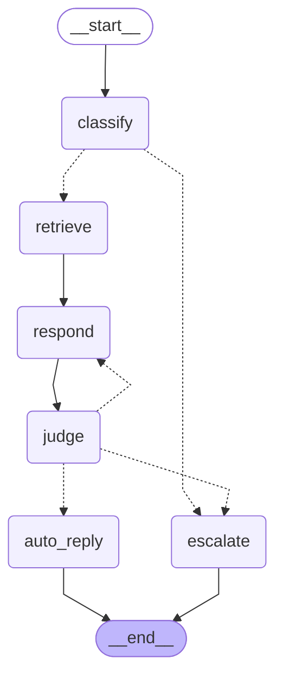

# The graph

Rendered from the compiled `StateGraph` itself, so it cannot drift from the
code the way a hand-drawn diagram would. Regenerate with:

```bash
TRIAGE_LLM=stub .venv/bin/python -m triage.diagram
```



The two decision points are what make this a graph rather than a chain:

- **After `classify`** -- an abusive or action-requiring ticket goes straight
  to `escalate`, skipping retrieval and drafting entirely. Cheapest correct
  behaviour for the worst input.
- **After `judge`** -- `SEND` to `auto_reply`, `RETRY` back to `respond`
  (capped at one attempt), or `ESCALATE` to a human.

Dotted edges are conditional; solid edges are unconditional.
